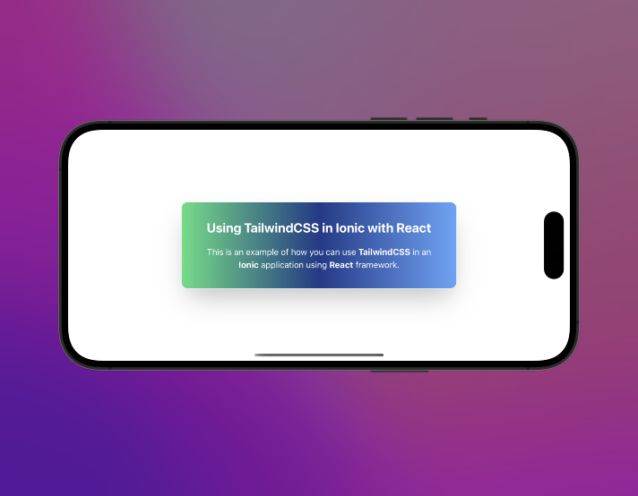

# Integrating TailwindCSS and Ionic-React application.

A starter template for `ionic-react` with `tailwindcss`

Read the full article [here](https://medium.com/p/c038b95af704#3136-23e56f83a5eb)

## Installation
- Ensure you follow the steps [here](https://ionicframework.com/docs/intro/cli) to install ionic framework
- Clone this repository to local development environment
- Change directory into `ionic-react-starter-template`
- Run `npm install` or `yarn install`
- Run `npm run start:dev` to run the app
- You can view the app in the browser also using the generated `http://hostname:port` usually http://localhost:8100

